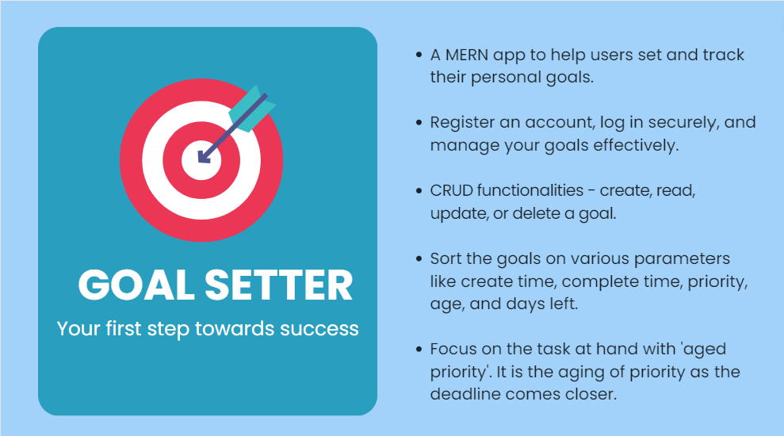

# GoalSetter🎯 - Your Ambition Ally!
Welcome to GoalSetter🎯!   

# Table of Contents📄
- Demo
- Features
- Installation
- Usage
- Future Enhancements
- License

# Demo💻

https://github.com/Atigit15/GoalSetter/assets/77894729/10646b9c-527e-418f-ab41-f722aaa0fae2

  
# Features💫
- **User Authentication** - GoalSetter offers a robust user authentication system that ensures secure access to the app. 
  - Register: Users can register their accounts using a unique email address and password.
  - Login: Subsequently, log in with their credentials.
  - Authentication is implemented with the help of JWT tokens. The user remains signed in until he closes the tab.
  - Various checks on login and register forms are added to ensure robustness.

- **Goal Management** - Once logged in, users gain access to their personalized dashboard. From here, they can easily

    - **Add Goals:** Create new goals by specifying goal detail.
    - **Update Goals:** Modify existing goals..
    - **Read Goals**: View a comprehensive list of all their goals.
    - **Delete Goals:** Remove completed or obsolete goals from their list, keeping their dashboard clutter-free.
      
- **Priority**: Users can assign priority levels to their goals, allowing them to prioritize their efforts effectively.
  
- **Completion Time**: Users can associate a deadline with the goal. 

- **Priority Ageing**: Does aging sounds familiar? It will if you have studied process scheduling algorithms in OS. Aging solves a critical problem of starvation, in which ready-to-run processes are not able to acquire the CPU. To prevent this, their priority is increased periodically. Taking inspiration from this, in this app priority of the goals, will keep increasing as the deadline comes closer. This prevents procrastination and allows the users to focus on the most important tasks.

- **Sorting**: Sort the goal on a variety of its properties like:
  - Date at which goal was created
  - Date at which goal is to be completed (deadline)
  - Age (Days the goal has been in the dashboard)
  - Days left until the deadline
  - User set priority of goals
  - Aged priority (priority based on how close is the deadline)
  
- **Form Validation**: Made validation checks to the login and register forms, which now display error messages through the Toastify API. I also implemented validation checks for the forms used to add and update goals, which prevent users from setting a completion time earlier than the current date or a negative priority. These changes have improved data consistency.

# Installation🛠️
To run GoalSetter locally, follow these steps:

- Clone the repository: `git clone https://github.com/AtiGit15/goalsetter.git`
- Navigate to the project directory: `cd goalsetter`
- Install server dependencies: `npm install`
- Navigate to the client directory: `cd client`
- Install client dependencies: `npm install`
- Go back to the main project directory: `cd ..`
- Create a .env file and add :
   - NODE_ENV: (development)
   - PORT: (desired port number / 5000 )
   - MONGO_URL: (MongoDB connection URL)
   - JWT_SECRET: (a string used for encrypting tokens)
- Run the app: `npm run dev`
  
# Usage💻
- Register an account using your name, unique email address, and password.
- Log in to access your personalized dashboard.
- Add your goals 
- Update or delete goals as needed.
### Stay motivated, track your progress, and achieve your dreams with GoalSetter!

# Future Enhancements💫

- Filtering Goals: Easily filter and sort goals based on priority and target dates.
- Notifications: Receive reminders and notifications to stay on top of your goals.
- Data Insights: Gain valuable insights and visualizations on your goal progress.
  
# License📄

This project is licensed under the MIT License. Please feel free to use, modify, and distribute this code according to the terms of the license.

---
We hope GoalSetter helps you stay focused and accomplish your aspirations. 
Feel free to star the repository if you find it useful, and don't forget to share it with others who might benefit from this tool. 
Happy goal setting! 🎯 
